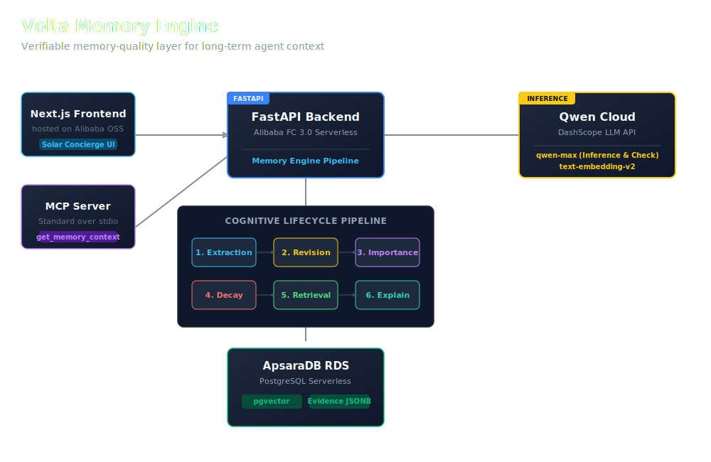

# Volta Memory — Architecture

This document points to the submitted architecture diagram and summarizes the system topology.

## Components

```
┌─────────────┐     HTTPS      ┌──────────────────┐
│  Next.js    │ ──────────────▶│  FastAPI backend │
│  frontend   │                │  (Alibaba ECS/FC)│
└─────────────┘                └────────┬─────────┘
                                        │
                    ┌───────────────────┼───────────────────┐
                    ▼                   ▼                   ▼
            ┌──────────────┐   ┌──────────────┐   ┌─────────────────┐
            │ Qwen Cloud   │   │ Postgres RDS │   │ Alibaba proof   │
            │ (inference)  │   │ + pgvector   │   │ SDK verification│
            └──────────────┘   └──────────────┘   └─────────────────┘
```

## Data flow (chat turn)

1. Frontend `POST /sessions/{id}/messages`
2. Backend loads active memories for `entity_id`, ranks and packs to token budget
3. System prompt built with confidence-tier phrasing (`chat/volta_prompt.py`)
4. Qwen Cloud completes the response (`chat/qwen_client.py`)
5. Assistant message stored with `memory_context_used` snapshot
6. On session end, extraction writes typed memories (`memory/extraction.py`)

## Key modules

| Path | Role |
|------|------|
| `backend/app/memory/` | Decay, retrieval, contradiction, extraction, consolidation |
| `backend/app/chat/` | Qwen client, tokenizer, session lifecycle |
| `backend/eval/` | 20-persona benchmark harness (systems A–D) |
| `deployment/proof/` | Alibaba Cloud deployment verification script |

## Diagram asset

The architecture diagram is available in the repository at [docs/architecture.svg](file:///wsl.localhost/Ubuntu/home/lx_singw/projects/volta-memory/docs/architecture.svg).



Full design: [docs/03_Memory_System_Design.md](file:///wsl.localhost/Ubuntu/home/lx_singw/projects/volta-memory/docs/03_Memory_System_Design.md)
