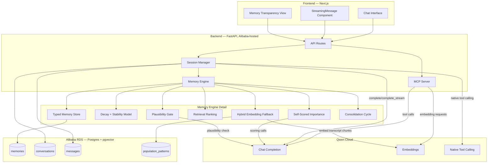
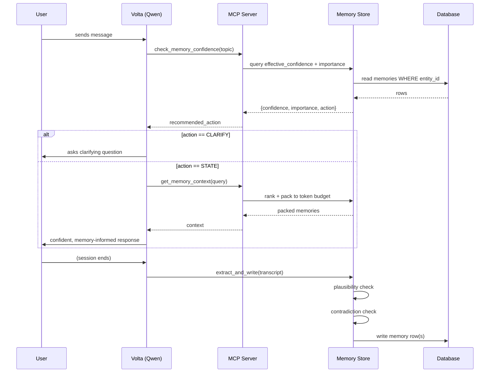
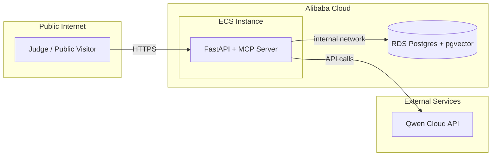

# Volta Memory — Architecture Diagram Specification
**Qwen Cloud Global AI Hackathon | Track 1: MemoryAgent**
**Satisfies the submission requirement: "Include an Architecture Diagram showing a clear visual representation of your system"**

---

## Table of Contents
- [1. Purpose](#1-purpose)
- [2. Full System Diagram (Mermaid Source)](#2-full-system-diagram-mermaid-source)
- [3. Memory Pipeline Detail Diagram](#3-memory-pipeline-detail-diagram)
- [4. Deployment Topology Diagram](#4-deployment-topology-diagram)
- [5. How to Render These](#5-how-to-render-these)

---

## 1. Purpose

The submission requirement asks specifically for a diagram showing "how Qwen Cloud connects to your backend, database, and frontend." This document provides three diagrams at different levels of detail, all as Mermaid source — renderable directly on GitHub (which natively supports Mermaid in markdown), so the architecture diagram requirement is satisfied by this file alone appearing in the repository, with no separate image-export step required, though a rendered PNG/SVG export should also be generated and embedded in the main README for anyone viewing outside GitHub's renderer.

---

## 2. Full System Diagram (Mermaid Source)

---

## 3. Memory Pipeline Detail Diagram

---

## 4. Deployment Topology Diagram

---

## 5. How to Render These

- GitHub renders Mermaid blocks natively in any `.md` file — this document, viewed on GitHub, already displays all three diagrams without additional tooling
- For the main repository README and the Devpost submission (which may not support live Mermaid rendering), export static PNG/SVG versions using the Mermaid CLI (`mmdc`) or the Mermaid Live Editor, and embed the exported image alongside a link back to this document's live-rendered source
- The deployment proof recording (Document 07's compliance checklist) should visually reference the topology diagram (Section 4) when narrating which Alibaba Cloud components are actually running, so a judge can map the live recording directly onto the diagram
